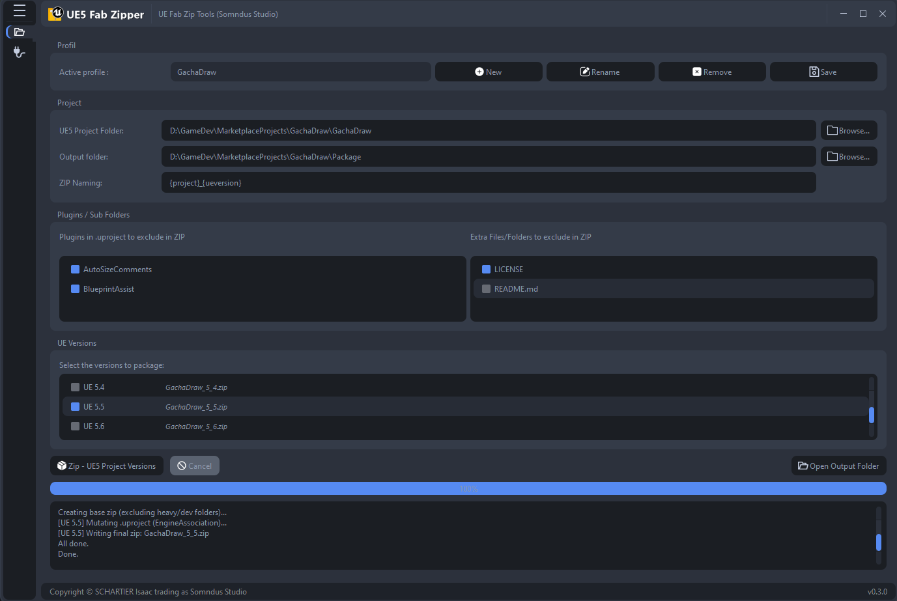

# UEFabZipTools

A lightweight utility to package Unreal Engine 5 project templates into zip archives, with version switching and plugin exclusion support.




## Installation

Edit the `configs/app_config.json` file to point to your local `7z.exe` path.  
Example:

```json
{
  "seven_zip_path": "C:/Program Files/7-Zip/7z.exe"
}
```

---

## Command Reference

### Run the application

```bash
py -m src.main
```

Run with fault handler enabled:

```bash
py -X faulthandler -m src.main
```

### Compile UI files

If you change `.ui` files with Qt Designer, regenerate the Python bindings:

```bash
pyside6-uic src/ui/project_fab_windows.ui -o src/windows/ui_project_fab_windows.py
```

### Update translations

Extract translatable strings into a `.ts` file:

```bash
pyside6-lupdate . -recursive -source-language en -ts i18n/app_fr.ts
```

---

## Build Executable

Install PyInstaller:

```bash
pip install pyinstaller
```

Build a single-file Windows executable:

```bash
pyinstaller src\main.py --name UEFabZipTools --onefile --noconsole --icon=assets/app.ico --add-data "settings.json;."
```

The output executable will be located in the `dist/` folder.

---
